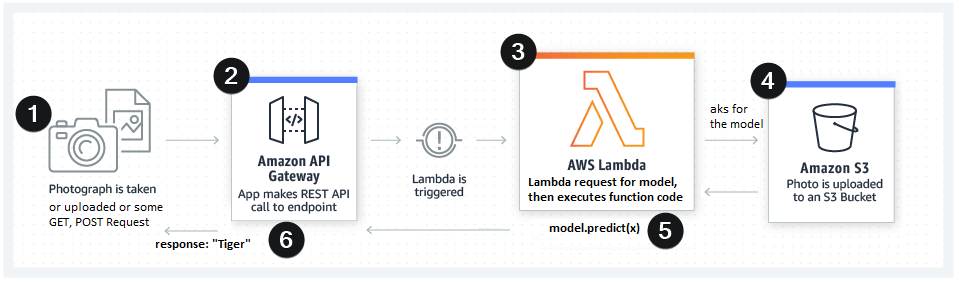
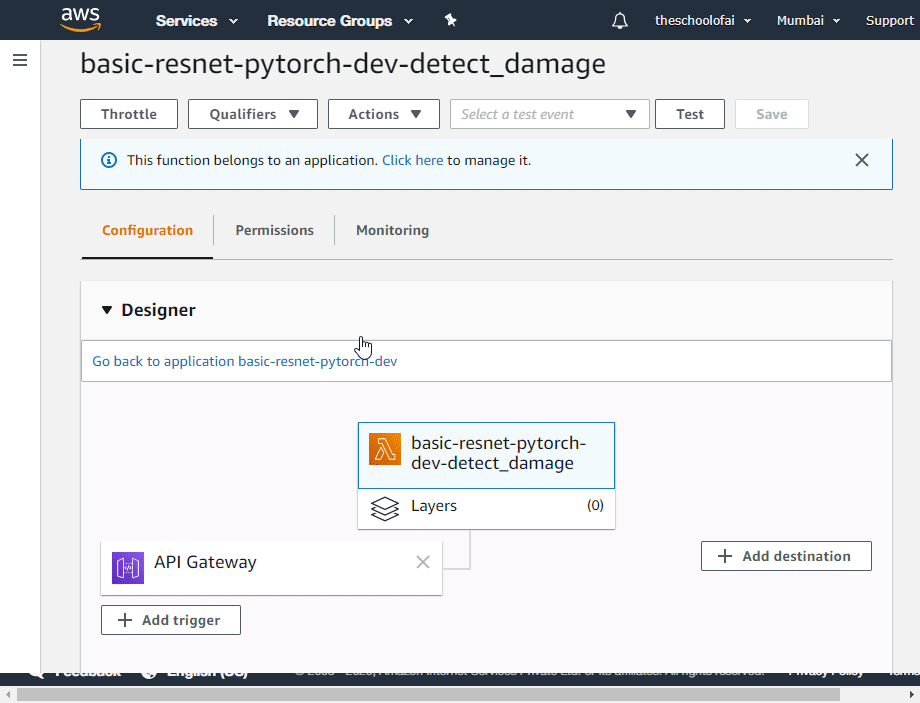

# Deploying DL model as a function to AWS Lambda

The objective is to deploy a model in production and make it available via API calls.

It is done by employing serverless framework and AWS lambda.

## [Serverless](https://www.serverless.com/) 

> Serverless Framework is a free and open-source web framework written using Node.js. It is the first framework developed for building applications on AWS Lambda, a serverless computing platform provided by Amazon as a part of Amazon Web Services but now can work with others as well. 

* It is used for building serverless applications via command line and config files
* It uses Amazon CloudFormation under the hood, which allows you to describe and provision all the infrastructural resources you need using a single JSON file. 
    * Once we define this config file and deploy, all resources will be created in the cloud for us. 


## [AWS Lambda](https://aws.amazon.com/de/lambda/features/ "AWS Lambda features")

> AWS Lambda is a computing service that lets you run code without managing servers. It executes your code only when required and scales automatically, from a few requests per day to thousands per second. You only pay for the compute time you consume — there is no charge when your code is not running, and you are charged for every 100ms your code executes but the caveat is your function code and it's dependencies **shouldn't be greater than 250MB** (deployment package .zip file)


* Runs on Amazon Linux OS, inside a runtime container
* The more RAM memory you allocate, the faster CPU you get:
    * from 128MB to 3008 MB, in 64 increments
* Max. 500MB of storage inside /tmp directory (where your code/files can expand)
* Free Tier:
    * 1 million requests per month ($0.0000002 per requests thereafter)
    * 400,000 GB-seconds of compute time per month ($0.000000208 for every 100ms and 128 MB of RAM used thereafter)


## What are we doing 



## Setup

### [Install Node and npm](https://github.com/nodesource/distributions)

I've used v10.x on Ubuntu machine
```
    curl -sL https://deb.nodesource.com/setup_10.x | sudo -E bash -
    sudo apt-get install -y nodejs
```
Check the installation by checking nodejs and npm versions
```
node -v
npm -v
```

### [Install the Serverless(SLS) framework](https://www.serverless.com/framework/docs/providers/aws/guide/installation/)

```
sudo npm install -g serverless
```
check is serverless is installed properly:
```
serverless -help
```

### Setting up SLS with AWS

##### Configure Serverless using your key and secret from AWS.

```
sls config credentials --provider aws --key IBWDBSFP1ACH3EJPAAGQ --secret xph8vFUkvLinL0f3e2FrtBk1NijOKjI18DjFMEqm
```

##### Create a new project 
```sls create --template aws-python3 --name mobilenet_pretrained --path mobilenet_lambda```

##### install [serverless plugin](https://github.com/UnitedIncome/serverless-python-requirements) (read [this](https://www.serverless.com/blog/serverless-python-packaging) for details) in the required environment

```sls plugin install -n serverless-python-requirements```

### Other stuff

#### Install docker, if reqiured

    > Docker packaging is essential if you need to build native packages that are part of your dependencies like Psycopg2, NumPy, Pandas, etc - [serverless blog](https://www.serverless.com/blog/serverless-python-packaging)

#### Adding Requirements to requirements.txt

We have to create a requirements.txt file on the root level, with all required Python packages. But you have to be careful that the **deployment package size must not exceed 250MB unzipped**. You can find a list of all AWS Lambda limitations [here](https://docs.aws.amazon.com/lambda/latest/dg/gettingstarted-limits.html).

If we would install Pytorch with pip install torch the package would be around ~ 470 MB, which is too big to be deployed in an AWS Lambda Environment. Thus, we are adding the link to the python wheel file (.whl) directly in the requirements.txt. For a list of all PyTorch and torchvision packages consider [this list](https://download.pytorch.org/whl/torch_stable.html).

#### Make dependencies smaller

To make the dependencies even smaller we will employ three techniques available in the serverless-python-requirements plugin, and make necessary modifications to config file mentioned below

1. zip - Compresses the dependencies in the requirements.txt in an additional .requirements.zip file and addsunzip_requirements.py in the final bundle.
2. slim - Removes unneeded files and directories such as *.so, *.pyc, dist-info, etc.
3. noDeploy - Omits certain packages from deployment. We will use the standard list that excludes packages those already built into Lambda, as well as Tensorboard.

---

## Configure and Deploy

Once the setup is completed, modify handler script and the config file as required and deploy using ```sls deploy```

> Read this [amazing post on medium](https://towardsdatascience.com/scaling-machine-learning-from-zero-to-hero-d63796442526) for very detailed info

We can also package this and deploy using npm, by creating a package.json and running ```npm run deploy```


### Things to note

* Make sure that to verify the region before deploying, services will be created and will be _accessible via aws management console of that region only_. 

* Verify that you have allowed required type in the API Gateway requests. For images it should be multipart/form-data as can be seen below




* When deployed, everytime whole pacakge will be deployed on to AWS. Be very sparse while deploying, do all verifications offline before deploying. 
    * Invoke the fuction locally using ```serverless invoke local --fucntion function_name```
    * Always test on local dev env before deploying. Check out [this article](https://www.serverless.com/framework/docs/providers/aws/cli-reference/invoke-local/) for different ways of testing locally
        * Other options would be 
        1. Setting up a CI/CD pipeline via GitHub actions
        2. using cloud env to speed up transfer and save on bandwidth on deployment. One option would using be Google Colab, with some setup


* Lamdba has inbuilt logger which logs the status of the server, but for our functions we have to add a console output to be able to debug. 
    * it helps a lot to know where exactly the error has occured, logging to console after every major step would help to identify the error location

## Test and Validate

Testing from Insomnia

> Make sure to set the Header to ```Content-Type : multipart/form-data``` if sending images


You can also test using Postman or from CLI [using Curl](https://stackoverflow.com/a/28045514/7445772) 

``` 
curl -i -X POST -H "Content-Type: multipart/form-data" -F "file=@<filepath>" url 
```


Thanks to [Rohan Shravan](https://in.linkedin.com/in/rohanshravan) for [The School of AI](https://theschoolof.ai/) and to this excellect blog post for [serverless config](https://towardsdatascience.com/scaling-machine-learning-from-zero-to-hero-d63796442526#5792) section