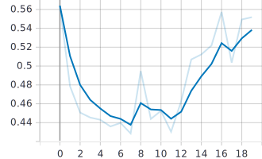

# Deploying an image Classification model as serverless service on AWS Lambda

- [Deploying an image Classification model as serverless service on AWS Lambda](#deploying-an-image-classification-model-as-serverless-service-on-aws-lambda)
- [Objective](#objective)
- [Data collection](#data-collection)
  - [Observations](#observations)
- [Data Pipeline](#data-pipeline)
    - [Preprocessing](#preprocessing)
- [Data Loader](#data-loader)
  - [Mean and std](#mean-and-std)
  - [train-test-split](#train-test-split)
  - [Transformations/Augmentations](#transformationsaugmentations)
    - [Train transformations](#train-transformations)
    - [Test transformations](#test-transformations)
  - [Sample batch visualization](#sample-batch-visualization)
    - [without Transformations](#without-transformations)
    - [after transformations](#after-transformations)
- [Training](#training)
  - [Classification report](#classification-report)
  - [Confusion Matrix](#confusion-matrix)
  - [Training logs - Tensorboard](#training-logs---tensorboard)
    - [Batchwise Train loss](#batchwise-train-loss)
    - [Epoch vs Test accuracy](#epoch-vs-test-accuracy)
    - [Epoch vs Train accuracy](#epoch-vs-train-accuracy)
    - [Epoch vs Test Loss](#epoch-vs-test-loss)
    - [Epoch vs Train Loss](#epoch-vs-train-loss)
  - [classwise misclassified images](#classwise-misclassified-images)
- [Deployment](#deployment)
- [Conclusion](#conclusion)


# Objective
Create a model to classify if given image has any of the 4 classes - Small quadCopter, Large quadCopter, Winged Drones and Flying Birds. Deploy it as an api service via serverless on AWS Lambda.

Target:
- Min. 80% accuracy
- Small enough to deploy on Lamdba


# Data collection

Data is scraped by around 20+ teams and saved to a shared google drive folder. Different search engines like _Flickr, Bing, Yahoo, DuckDuckGo, Baidu, unsplash and such were used apart from Google Images_. Also the search terms are changed by using long tail keywords by adding location names, color and suchto add variance. Scraped files are not renamed so that similar files can be ignored/replaced.


## Observations 
> Since multiple people have write access to the drive folder, current datalake it emulates real world case where the users would be uploading the data. 
  - Data is not consistent and ever changing every few hours
  - Data consists of all kinds of file formats - 
      ```
            {
             '.JPEG': 1,
             '.JPG': 35,
             '.Jpg': 1,
             '.PNG': 2,
             '.gif': 11,
             '.jpeg': 1645,
             '.jpg': 14671,
             '.png': 192,
             '.ppm': 3,
             '.svg': 1,
             '.webp': 7
             }
      ```
  - Files sizes vary a lot - ```each file size varies from less 100 Kb to more than 30 Mb```
  - Image shapes vary a lot with respect to both resolution and aspect ratio
  - Same file names with different formats
  - Contains lots of incorrect class images like search icons, promotional and marketing materials etc..
  - Class imbalance is present

    Class | Images | Percentage
    ------|--------|-----------
    Flying_Birds | 8339 | 38.25
    Large_QuadCopters | 4168 | 19.12
    Small_QuadCopters | 3624 | 16.62
    Winged_Drones | 5673 | 26.02
    **Total**  | _22193_ | _100%_

    
# Data Pipeline

- Take Freeze/snapshot of the data and worked with it
  - Compressed the classwise folders to create a model. Has around 20k images
 
- Datalake is prepared by iterating through the data and preprocessing it to make it consistent 

### Preprocessing

<!-- Preprocessing is done on amazon ec2 instance. The zip files are downloaded from googlr drive using [wget](https://medium.com/@acpanjan/download-google-drive-files-using-wget-3c2c025a8b99), extracted and preprocessed and moved to [S3 bucket](https://stackoverflow.com/a/28396098/7445772) from ec2 instance -->

  - ~~Scaled down large images, keeping the aspect ratio same~~ Done during training transformations _(thereby keeping the validation data untouched)_
    - ~~Explored PIL ImageOps~~ 
    - ~~thumbnail method of PIL Image~~
  - ~~Small images are padded~~ during training transforms
  - all images saved as jpg images
  - _Incorrect class images are not handled and left for the network to takecare_.
  - Class imbalance could been handled by 
    - scraping additional data
    - upsampling 
    - [balanced sampling batches](https://discuss.pytorch.org/t/balanced-sampling-between-classes-with-torchvision-dataloader/2703)
    - Augmentating the data
  - Renaming the files
    - handles same file names with different extensions
    - helps keep the file names easy for accessing and processing
    - Furthermore since the images are written to a Zipfile object, renaming avoids duplicates as [ZipFile accepts duplicates](https://stackoverflow.com/q/22143908/7445772) 


  For our current target - we can go with augmentating data and no need for any additional handling of the imbalance, however we will use stratified train test split for testing

 | Data size
-|----------
 | Size of the initial data snapshot  _**~ 4.6Gb**_
 | Size of the processed data without image resizing _**~ 1.5Gb**_
 | Size of the processed data with image resizing _**~ 200Mb**_

Preprocessing script can be found [here](utils/data_preprocess.py)

---

# Data Loader

Created a custom Dataset class([here](utils/dataset.py#L45)) inherited from the torch data which reads from the classwise zipfiles.

But found that it is taking more time than if the data is uncompressed, also got to know that ZipFile object is not thread safe. Since the dataset size is small, thanks to preprocessing, the data is uncompressed and a [new dataset class](utils/dataset.py#L11) is created to fetch the data from the uncompressed folder

## Mean and std
Mean and standard deviation is calculated for the data, with out any transformations

`mean = ['0.533459901809692', '0.584880530834198', '0.615305066108704']`

`std  = ['0.172962218523026', '0.167985364794731', '0.184633478522301']`

## train-test-split
Stratified split of 70% - 30% is done between train and test sets respectively

## Transformations/Augmentations

> Used albumentations library for the all the transformations

### Train transformations

* `Horizontal Flip`
    * looking at the dataset, we cannot do vertical flip (birds flying upside down ? quadcopters upside down ? doesn't seem right), so we go for horizontal flip
* `LongestMaxSize`
    * this will resize the image such that the longest size (width/height) is 500 pixels
* `Normalize`
    * We've already calculated the mean and std of the dataset so we normalize it during training. 
      * It standardizes the inputs to a layer for each mini-batch. This also has the effect of stabilizing the learning process since the difference between pixels is now much lesser
* `PadIfNeeded`
    * this is the tricky part, the model needs a square image, and the images in our dataset are not squares, so we pad the image such that it becomes a square of 500x500
* `Resize`
    * Since the plan is to use a pretrained network, it expects a 224x244 image so we convert it to such
* `Rotate`
    * addtional transformation to just tilt the image by +-30 degrees to increase the test accuracy
* `CutOut`
    * Cutout regularization is similar to dropout but instead of randomly removing pixels, as the name suggests, we cut-out some boxes. It works better, as proved in its paper
* `ToTensor`
    * Model expects a tensor input

### Test transformations

* `Normalize`
    * We've already calculated the mean and std of the dataset so we normalize it during training
* `Resize`
    * Since the plan is to use a pretrained network, it expects a 224x244 image so we convert it to such
* `ToTensor`
    * Model expects a tensor input

## Sample batch visualization

### without Transformations


### after transformations


# Training

Model | `Pretrained MobileNetV2`
------|-------------------------
Loss | `CrossEntropyLoss`
Optimizer | `SGD`
Learning rate | `0.001 - Constant(No scheduler used)`
LR momentum | `0.95`
epochs | `20`

## Classification report
```
                   precision    recall  f1-score   support

     Flying_Birds       0.96      0.99      0.98      2449
Large_QuadCopters       0.58      0.91      0.71      1466
Small_QuadCopters       0.84      0.31      0.45      1084
    Winged_Drones       0.94      0.80      0.87      1659

         accuracy                           0.82      6658
        macro avg       0.83      0.75      0.75      6658
     weighted avg       0.85      0.82      0.80      6658
```

## Confusion Matrix


## Training logs - Tensorboard

### Batchwise Train loss


### Epoch vs Test accuracy


### Epoch vs Train accuracy


### Epoch vs Test Loss


### Epoch vs Train Loss


## classwise misclassified images

```
{
	'Flying_Birds': 18,
	'Large_QuadCopters': 133,
	'Small_QuadCopters': 748,
	'Winged_Drones': 324
 }
```


# Deployment

The model is deployed on AWS Lambda via serverless, for details on how to do that check [this](https://github.com/hemanth346/EVA4_Phase2/blob/master/Session1/README.md). 

> UI is in progress, the model will be exposed once its done and will be updated here.

# Conclusion

We have achieved the objective with over 80% test accuracy, and deployed the model on AWS Lambda 
